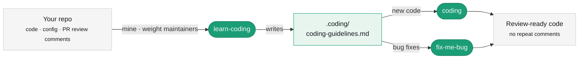

<p align="center">
  <picture>
    <source media="(prefers-color-scheme: dark)" srcset="assets/logo-dark.svg">
    
  </picture>
</p>

<p align="center"><strong>Write code that passes review the first time.</strong></p>

<p align="center">
Three agent skills that learn your team's real conventions from its pull-request comments —<br>
so a coworker or lead never has to leave the same comment twice.
</p>

<p align="center">
  <a href="https://skills.sh/samuelgja/coding-skills"></a>
  
</p>

## Install

```bash
npx skills add samuelgja/coding-skills
```

Works with Claude Code, Cursor, Codex, Copilot, Windsurf, Gemini, and more — the CLI auto-detects your agent.

## The three skills

| Skill | What it does |
|-------|--------------|
| **learn-coding** | Reads your repo's code and **PR review comments** (weighting owners & maintainers) and writes the team's real rules to `.coding/`. Run once; re-run to refresh. |
| **coding** | Applies those rules — on top of a strict baseline — every time you write code, so it passes review the first time. |
| **fix-me-bug** | Test-first bug fixing that follows the same rules, so the fix doesn't draw new comments. |

## How it works



Commit `.coding/` so the whole team shares one standard. No learned file yet? `coding` and `fix-me-bug` still work on a strict built-in baseline — run `learn-coding` to make them yours.

> `learn-coding` uses the GitHub CLI (`gh`). The other two need nothing.

## License

MIT
